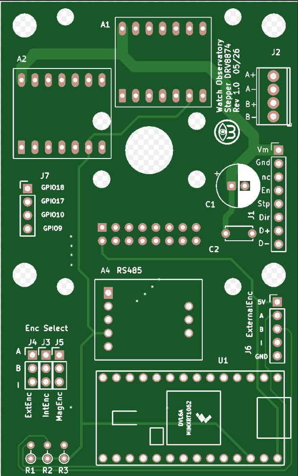

Stepper motor driver using two DRV8874 Pololu assemblies for direct and FOC control, AS5047D magnetic position sensing assembly and RS485 assembly. Teensy 4.0 via Arduino IDE to code control of these assemblies. 
The emphasis is control of a Right Ascension axis of an equatorial telescope as the original Makerbase Servo57D did not allow for reducing a rythmic 1+ arcsec variation due to motor pole differences as Makerbase does not provide open sources or access to the processor. In sidereal and pulse tracking mode, direct current control (D axis in D-Q rotor frame of reference) is used as FOC at the 0.25 RPM does not allow sufficient finesse (the stepper is driving a worm directly that drives a 360 tooth gear, 0.25 RPM equates to sidereal), and FOC for slewing.

The board mounted on the back of a Nema 23 stepper for the AS5047D, or if an external (glass type) ABI encoder is used, jumpers provide that programmation.

